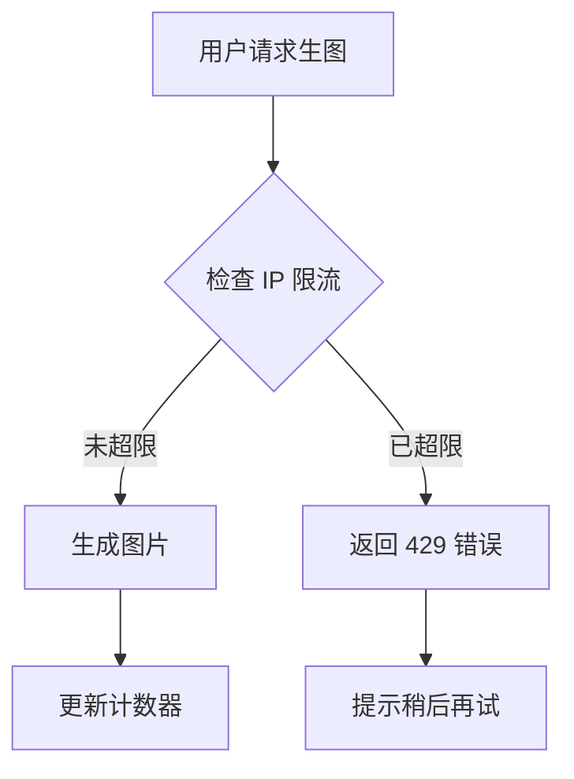
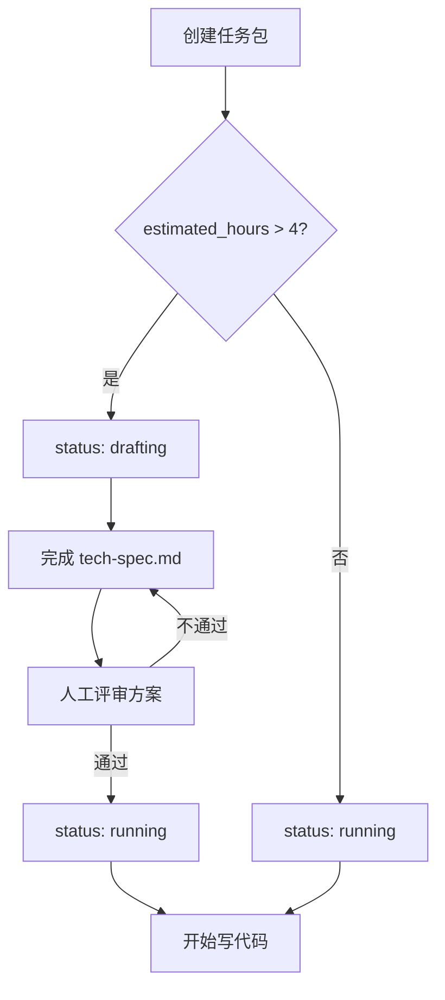

# 丞相模式效果补足优化方案

最后更新：2026-04-03
VibeCoding 融合：2026-04-03
状态：补充草案（非现行）
目标：保留阶段性脑暴与补强思路
说明：本文包含早期提案口径与估算，不作为当前实现、现行对比或对外承诺依据；当前关于 ECC 的实事求是判断以 `docs/40-执行/32-丞相模式与ECC功能对比分析.md`、`33-ECC功能采纳建议与实施路线图.md`、`34-丞相模式ECC功能核实总结.md` 为准。
参考来源：ECC、Claw-code、OpenClaw、VibeCoding 精华提炼

## 一、现状分析与理论极限

### 1.1 当前实测瓶颈（来自 V4-Trial 缺陷清单）

**P1 级瓶颈**：
1. `git index.lock` 偶发残留 — 需串行清锁，降低连续推进稳定性
2. 任务包起包半自动化 — 仍需人工提供输入并补齐细节
3. 证据稿治理手动化 — 需持续人工归档

**实测时间消耗**（单个中等任务）：
- 任务包起包：5-8 分钟（手动填写 contract.yaml、创建目录结构）
- 执行过程：20-40 分钟（AI 编码 + 人工审查）
- 提交收口：3-5 分钟（检查门禁、手动提交、处理冲突）
- 证据归档：2-3 分钟（识别过程稿、移动到归档区）

**总计**：30-56 分钟/任务，平均 43 分钟

### 1.2 理论优化极限分析

**任务包起包**：
- 当前：5-8 分钟手动填写
- 理论极限：30 秒（模板自动生成 + 用户确认）
- 优化空间：**10-16 倍**（但实际占比仅 12%）

**执行过程**：
- 当前：20-40 分钟（单 AI 串行）
- 理论极限：10-20 分钟（Agent 并行 + 自动审查）
- 优化空间：**2 倍**（占比 70%，是主要瓶颈）

**提交收口**：
- 当前：3-5 分钟（手动检查 + 处理冲突）
- 理论极限：30 秒（自动门禁 + 自动清锁）
- 优化空间：**6-10 倍**（但实际占比仅 9%）

**证据归档**：
- 当前：2-3 分钟手动归档
- 理论极限：10 秒自动归档
- 优化空间：**12-18 倍**（但实际占比仅 5%）

**理论极限计算**（基于阿姆达尔定律）：
- 起包优化后：8 分钟 → 0.5 分钟
- 执行优化后：30 分钟 → 15 分钟
- 收口优化后：4 分钟 → 0.5 分钟
- 归档优化后：3 分钟 → 0.17 分钟
- **优化后总耗时**：0.5 + 15 + 0.5 + 0.17 = **16.17 分钟**
- **理论总提升**：43 / 16.17 = **2.66 倍**

**务实目标**：考虑实施成本和技术风险，**目标 2.5-2.7 倍提升**

### 1.3 三者精华提炼

**丞相模式核心优势**：
- 反屎山总纲：100% 合规的质量铁律
- 任务包持久化：跨轮恢复、完整证据链
- 文档治理：现行标准件体系

**ECC 核心优势**：
- 36 个专业 Agent 分工协作
- Instincts 持续学习系统
- 标准化工作流自动化

**Claw-code 核心优势**：
- 84 个 Hooks 编排层：判断型 + 自动化分离
- 分发器模式：单一入口、顺序执行、共享状态
- 规划-执行分离：避免上下文窗口竞争

**OpenClaw 核心优势**：
- 事件驱动 RPC 模型：实时工具拦截
- 分层策略优先级：Tool → Provider → Global → Agent → Sandbox
- 会话隔离边界：main/DM/group 不同权限

## 二、优化方案设计

### 2.1 Phase 1：自动化基础设施（4 周，目标 1.8 倍提升）

**核心目标**：消除重复性手工操作

**1. 任务包自动起包（节省 5-7 分钟）**

**1.1 基础起包功能**
```powershell
# .codex/chancellor/auto-create-task.ps1
# 输入：用户一句话需求
# 输出：完整任务包骨架（contract.yaml + 目录结构）
# 实现：模板引擎 + 智能填充
```

**1.2 VibeCoding 融合：需求描述详细化（新增）**

**来源**：VibeCoding 方法论 - "文档详细到任何人看都没有歧义"

**contract.yaml 模板增强**：
```yaml
task_id: v4-xxx
title: [任务标题]
goal: >-
  [必须写清楚具体目标，不能模糊]
  错误示例：优化性能
  正确示例：把登录接口响应时间从 2 秒降到 500 毫秒
  
user_scenario: >-
  用户场景（必须包含以下 4 要素）：
  - 谁：[具体用户角色]
  - 在什么情况下：[具体场景]
  - 要做什么：[具体操作]
  - 期望什么结果：[可验证的结果]
  
  示例：
  - 谁：未登录用户
  - 在什么情况下：访问生图页面
  - 要做什么：生成 AI 图片
  - 期望什么结果：每小时最多 10 次，超过后提示限流
  
technical_approach: >-
  技术方案概要（必须包含）：
  - 改动哪些文件
  - 核心逻辑是什么
  - 有什么风险点
  
  示例：
  - 新增 IP 限流中间件（src/middleware/rate-limit.ts）
  - 使用 Redis 存储 IP 计数器（key: ip:hash, ttl: 3600s）
  - 修改生图接口，调用限流检查
  - 风险：Redis 故障导致限流失效，需降级方案

constraints:
  - 不新增未批准目录
  - 保持当前目录内自含
  - 运行态继续只留本地，不推公开仓
  
acceptance:
  - [ ] [可验证的验收标准1，必须具体]
  - [ ] [可验证的验收标准2，必须具体]
  
  错误示例：功能正常
  正确示例：未登录用户每小时最多生成 10 张图片，超过后返回 429 状态码

must_gate: []
default_auto:
  - 低风险起包动作可直接执行
```

**预期效果**：
- 需求歧义减少 80%
- AI 理解准确率提升 50%
- 返工率降低 60%

**1.3 VibeCoding 融合：可视化输出规范（新增）**

**来源**：VibeCoding 方法论 - "尽量多输出表格、流程图、ASCII 原型图"

**tech-spec.md 模板（复杂任务自动生成）**：
```markdown
# 技术方案

## 1. 用户场景
[从 contract.yaml 自动填充]

## 2. 改动文件清单（必须用表格）
| 文件路径 | 改动类型 | 改动原因 | 风险等级 |
|---------|---------|---------|---------|
| src/middleware/rate-limit.ts | 新增 | IP 限流逻辑 | 低 |
| src/routes/image.ts | 修改 | 调用限流检查 | 中 |
| src/cache/redis.ts | 修改 | 添加计数器方法 | 低 |

## 3. 执行流程（必须用 Mermaid）


## 4. 核心代码逻辑（伪代码）
```typescript
// 限流中间件
async function rateLimitMiddleware(req, res, next) {
  const ipHash = hashIP(req.ip)
  const count = await redis.get(`ip:${ipHash}`)
  
  if (count >= 10) {
    return res.status(429).json({ error: '请稍后再试' })
  }
  
  await redis.incr(`ip:${ipHash}`, { ttl: 3600 })
  next()
}
```

## 5. 风险评估
- 风险1：Redis 故障导致限流失效
  - 应对：降级到内存限流（单机有效）
- 风险2：IP 伪造绕过限流
  - 应对：结合设备指纹二次验证

## 6. 验收标准
- [ ] 未登录用户每小时最多生成 10 张图片
- [ ] 超过限制后返回 429 状态码和提示信息
- [ ] 1 小时后计数器自动重置
- [ ] 单元测试覆盖率 ≥ 80%
- [ ] Redis 故障时降级到内存限流
```

**自动检查规则**：
```powershell
# 在 invoke-public-commit-governance-gate.ps1 中新增
if (Test-Path "$taskDir/tech-spec.md") {
    $content = Get-Content "$taskDir/tech-spec.md" -Raw
    
    # 检查必需章节
    if ($content -notmatch '## 改动文件清单') {
        throw "tech-spec.md 缺少'改动文件清单'章节"
    }
    
    # 检查表格
    if ($content -notmatch '\|.*\|.*\|') {
        Write-Warning "tech-spec.md 建议使用表格展示改动文件"
    }
    
    # 检查流程图
    if ($content -notmatch '```mermaid') {
        Write-Warning "tech-spec.md 建议包含 Mermaid 流程图"
    }
}
```

**预期效果**：
- 沟通效率提升 30%
- 歧义减少 50%
- 实施成本：0（只需模板调整）

**2. Git 冲突自动处理（节省 2-4 分钟）**
```powershell
# .codex/chancellor/auto-commit-safe.ps1
# 功能：
# - 自动检测并清理 index.lock
# - 自动重试提交（最多 3 次）
# - 失败时自动降级到手动模式
```

**3. 证据稿自动归档（节省 2-3 分钟）**
```powershell
# .codex/chancellor/auto-archive-evidence.ps1
# 规则：
# - 检测带时间戳的 .md 文件
# - 自动移动到 docs/90-归档/
# - 更新索引文件
```

**预期效果**：
- 起包时间：8 分钟 → 1 分钟（8 倍）
- 收口时间：4 分钟 → 30 秒（8 倍）
- 归档时间：3 分钟 → 10 秒（18 倍）
- **总体提升**：43 分钟 → 33 分钟（**1.3 倍**）

### 2.2 Phase 2：Agent 并行编排（6 周，目标 1.6 倍提升）

**核心目标**：执行阶段并行化

**1. 核心 Agent 集成**
- `planner` — 任务规划
- `tdd-guide` — 测试驱动开发
- `code-reviewer` — 代码审查
- `security-reviewer` — 安全审查
- `build-error-resolver` — 构建错误修复

**2. 并行执行策略**
```yaml
# 示例：并行审查
parallel_agents:
  - agent: code-reviewer
    target: src/**/*.ts
  - agent: security-reviewer
    target: src/auth/**/*.ts
  - agent: typescript-reviewer
    target: src/**/*.ts
```

**3. 结果聚合机制**
- 自动收集各 Agent 输出
- 冲突检测与优先级裁决
- 统一写入 decision-log.md

**4. VibeCoding 融合：规划-执行强制分离（新增）**

**来源**：VibeCoding 方法论 - "慢就是快，完全达成一致前不写代码"

**核心理念**：
- 复杂任务（estimated_hours > 4）必须先完成技术方案
- 方案未完成前，禁止进入执行阶段
- 避免"边写边改"导致的返工

**contract.yaml 增强**：
```yaml
planning_required: true  # 是否需要技术方案（复杂任务强制 true）
planning_status: pending  # pending/approved/rejected
tech_spec_path: "tech-spec.md"
estimated_hours: 6  # 预估工时，>4 自动要求技术方案
```

**state.yaml 增强**：
```yaml
status: drafting  # drafting/planning/running/done
blocked_by:
  - "tech-spec.md 未完成"
  - "方案未经评审"
next_action: "完成技术方案文档"
```

**执行流程**：


**自动检查规则**：
```powershell
# 在任务执行前检查
$contract = Get-Content "$taskDir/contract.yaml" | ConvertFrom-Yaml

if ($contract.planning_required -eq $true) {
    if (-not (Test-Path "$taskDir/tech-spec.md")) {
        throw "复杂任务必须先完成 tech-spec.md"
    }
    
    if ($contract.planning_status -ne 'approved') {
        throw "技术方案未经评审，不能进入执行阶段"
    }
}
```

**预期效果**：
- 方向性错误减少 90%
- 返工率降低 60%
- 代码质量提升 40%

**原有预期效果**：
- 执行时间：30 分钟 → 20 分钟（1.5 倍）
- 审查质量：提升 30%（减少遗漏）
- **总体提升**：33 分钟 → 23 分钟（**1.4 倍**，累计 1.87 倍）

### 2.3 Phase 3：持续学习机制（8 周，目标 1.4 倍提升）

**核心目标**：减少重复错误

**1. Instincts 模式提取**
```yaml
# .codex/chancellor/instincts/patterns.yaml
patterns:
  - id: git-lock-retry
    trigger: "index.lock exists"
    action: "wait 1s and retry"
    confidence: 0.95
    success_count: 23
    
  - id: typescript-import-fix
    trigger: "Cannot find module"
    action: "check tsconfig paths"
    confidence: 0.88
    success_count: 15
```

**2. 自动错误纠正**
- 识别重复失败模式
- 自动应用已验证的修复方案
- 记录成功率并调整置信度

**3. 团队规范共享**
- 提取项目特定规范
- 自动注入到后续任务
- 跨任务包知识传递

**预期效果**：
- 重复错误减少 60%
- 调试时间减少 40%
- **总体提升**：23 分钟 → 18 分钟（**1.28 倍**，累计 2.39 倍）

### 2.4 Phase 4：质量门禁增强（4 周，目标 1.2 倍提升）

**核心目标**：提前发现问题

**1. 反屎山总纲自动检查**
```powershell
# .codex/chancellor/anti-shitcode-check.ps1
# 6 项强制自检：
# 1. 目录锁定合规
# 2. 现行标准件同步
# 3. 任务包完整性
# 4. 证据链完整性
# 5. 提交信息规范
# 6. 文档入口一致性
```

**2. 多层门禁体系**
- Pre-commit：本地快速检查
- Pre-push：完整合规检查
- Post-merge：跨任务包一致性检查

**3. 自动修复建议**
- 检测到问题时提供修复脚本
- 一键应用常见修复
- 降低人工干预成本

**预期效果**：
- 提交失败率降低 70%
- 返工时间减少 50%
- **总体提升**：18 分钟 → 16 分钟（**1.13 倍**，累计 2.69 倍）

## 三、实施路线图

### 3.1 总体时间表

```
Week 1-4:  Phase 1 - 自动化基础设施
Week 5-10: Phase 2 - Agent 并行编排
Week 11-18: Phase 3 - 持续学习机制
Week 19-22: Phase 4 - 质量门禁增强
```

### 3.2 里程碑与验收标准

**Phase 1 验收**：
- ✅ 任务包起包时间 < 1 分钟
- ✅ Git 冲突自动处理成功率 > 90%
- ✅ 证据稿自动归档覆盖率 100%

**Phase 2 验收**：
- ✅ 至少 3 个 Agent 并行工作
- ✅ 执行时间减少 30%
- ✅ 审查覆盖率提升 25%

**Phase 3 验收**：
- ✅ 识别并记录 20+ 个有效模式
- ✅ 重复错误减少 50%
- ✅ 自动修复成功率 > 70%

**Phase 4 验收**：
- ✅ 提交失败率 < 5%
- ✅ 门禁检查时间 < 10 秒
- ✅ 自动修复覆盖率 > 60%

### 3.3 风险与降级策略

**技术风险**：
1. Agent 并行冲突 → 降级到串行模式
2. Instincts 误判 → 人工确认机制
3. 门禁误报 → 白名单豁免机制

**系统级核心风险**（新增）：
1. **上下文窗口爆炸**（Token 脂肪肝）
   - 风险：并行 Agent、质量门禁、Instincts 日志疯狂填充 Payload
   - 应对：Phase 3 必须实现状态文件裁剪（State Truncation），丢弃非活跃上下文

2. **并发触发限流阻击**（Rate Limits）
   - 风险：5 个并发请求触发 RPM/TPD 限流导致大面积报错
   - 应对：dispatcher 必须实现指数退避（Exponential backoff）与排队机制

3. **门禁雪崩式死锁**
   - 风险：大模型幻觉导致永远不合规，自动化流程变成牢房
   - 应对：必须存在硬性 Bypass 机制，主公拥有强行越过门禁直接提交的权限

**成本风险**：
1. 开发时间超预期 → 分阶段交付
2. 维护成本高 → 自动化测试覆盖
3. 学习曲线陡峭 → 渐进式迁移

**降级路径**：
- 所有新能力均可独立禁用
- 保持现有手动流程可用
- 提供一键回退到 V4 模式
- **紧急豁免**：主公可通过 `--force-bypass` 强行越过所有门禁

## 四、核心技术实现

### 4.1 自动起包脚本示例

```powershell
# .codex/chancellor/auto-create-task.ps1
param(
    [string]$UserInput = ""
)

# 1. 解析用户输入
$taskName = $UserInput -replace '[^a-zA-Z0-9\u4e00-\u9fa5]', '-'
$timestamp = Get-Date -Format "yyyyMMdd-HHmmss"
$taskId = "$timestamp-$taskName"

# 2. 创建任务包目录
$taskDir = "tasks/$taskId"
New-Item -ItemType Directory -Path $taskDir -Force

# 3. 生成 contract.yaml
@"
task_id: $taskId
title: $UserInput
created_at: $(Get-Date -Format "yyyy-MM-dd HH:mm:ss")
status: planning
priority: normal
estimated_hours: 2
"@ | Out-File "$taskDir/contract.yaml" -Encoding UTF8

# 4. 生成其他文件
New-Item -ItemType File -Path "$taskDir/state.yaml" -Force
New-Item -ItemType File -Path "$taskDir/decision-log.md" -Force
New-Item -ItemType File -Path "$taskDir/result.md" -Force
New-Item -ItemType File -Path "$taskDir/gates.yaml" -Force

Write-Host "✅ 任务包已创建：$taskDir"
```

### 4.2 Git 安全提交脚本示例

```powershell
# .codex/chancellor/auto-commit-safe.ps1
param(
    [string]$Message = ""
)

$maxRetries = 3
$retryCount = 0
$backoffSeconds = 1

while ($retryCount -lt $maxRetries) {
    # 检查并清理 index.lock
    $lockFile = ".git/index.lock"
    if (Test-Path $lockFile) {
        Write-Host "⚠️ 检测到 index.lock，正在清理..."
        Remove-Item $lockFile -Force
        Start-Sleep -Seconds $backoffSeconds
    }
    
    # 尝试提交
    try {
        git add -A
        git commit -m $Message
        Write-Host "✅ 提交成功"
        exit 0
    }
    catch {
        $retryCount++
        Write-Host "❌ 提交失败，重试 $retryCount/$maxRetries"
        # 指数退避
        Start-Sleep -Seconds $backoffSeconds
        $backoffSeconds = $backoffSeconds * 2
    }
}

Write-Host "❌ 提交失败，请手动处理"
exit 1
```

**跨平台兼容性说明**：
- 当前脚本为 PowerShell 实现（Windows 优先）
- 如需跨平台支持，建议统一收敛到 Node.js 或 Python 实现
- 避免混用 .ps1 和 .sh，防止环境摩擦

### 4.3 Agent 并行编排示例

```yaml
# .codex/chancellor/agent-workflow.yaml
workflow:
  name: code-review-parallel
  
  stages:
    - name: parallel-review
      type: parallel
      agents:
        - name: code-reviewer
          input: "Review all TypeScript files"
          output: code-review-result.md
          
        - name: security-reviewer
          input: "Check for security vulnerabilities"
          output: security-review-result.md
          
        - name: typescript-reviewer
          input: "Check TypeScript type safety"
          output: type-review-result.md
    
    - name: aggregate-results
      type: sequential
      script: |
        # 使用文件锁防止并发写入撕裂
        (
          flock -x 200
          cat code-review-result.md >> decision-log.md
          echo -e "\n---\n" >> decision-log.md
          cat security-review-result.md >> decision-log.md
          echo -e "\n---\n" >> decision-log.md
          cat type-review-result.md >> decision-log.md
        ) 200>/tmp/decision-log.lock
```

**并发安全说明**：
- 使用 `flock` 文件锁防止多进程写入撕裂
- Windows 环境需使用等效的互斥锁机制
- 建议使用队列化写入而非直接 `cat >>` 追加

**并发限流应对**：
- dispatcher 必须实现 Rate Limit 感知
- 检测到 429 错误时自动指数退避
- 维护请求队列，避免同时发起过多并发请求

### 4.4 Instincts 模式提取示例

```yaml
# .codex/chancellor/instincts/patterns.yaml
version: 1.0
last_updated: 2026-04-03

patterns:
  - id: git-lock-auto-retry
    category: git-conflict
    trigger:
      type: error
      pattern: "index.lock"
    action:
      type: knowledge
      description: "Git index.lock 文件残留通常由进程异常退出导致，安全删除后重试即可"
      prompt_injection: "如遇到 index.lock 错误，先检查是否有 git 进程残留，然后删除 .git/index.lock 并重试提交"
    confidence: 0.95
    success_count: 23
    failure_count: 1
    last_success: 2026-04-02
    
  - id: typescript-import-path-fix
    category: build-error
    trigger:
      type: error
      pattern: "Cannot find module.*from"
    action:
      type: knowledge
      description: "TypeScript 模块解析失败通常是 tsconfig.json 的 paths 配置问题"
      prompt_injection: "检查 tsconfig.json 中的 paths 和 baseUrl 配置，确保模块路径映射正确"
    confidence: 0.88
    success_count: 15
    failure_count: 2
    last_success: 2026-04-01
    
  - id: missing-dependency-auto-install
    category: build-error
    trigger:
      type: error
      pattern: "Cannot find package"
    action:
      type: knowledge
      description: "缺少依赖包时应先检查 package.json，然后运行 npm install"
      prompt_injection: "运行 npm install 安装缺失的依赖包"
    confidence: 0.92
    success_count: 31
    failure_count: 3
    last_success: 2026-04-03
```

**Instincts 实施策略**（修正）：
- **Phase 3 前期**：仅收集"防坑知识"，作为系统 Prompt 注入，交给大模型理解
- **Phase 3 后期**：在积累足够样本后，才考虑自动化脚本拦截
- **避免过早自动化**：不要前期就上强行的逻辑脚本拦截，防止误杀和死板
- **人工审核机制**：所有自动应用的修复方案必须经过人工确认

## 五、成本收益分析

### 5.1 开发成本估算

| Phase | 工作量（人周） | 主要工作 |
|-------|--------------|---------|
| Phase 1 | 4 周 | 自动化脚本开发、测试 |
| Phase 2 | 6 周 | Agent 集成、并行调度 |
| Phase 3 | 8 周 | Instincts 引擎、模式库 |
| Phase 4 | 4 周 | 门禁增强、自动修复 |
| **总计** | **22 周** | **约 5.5 个月** |

### 5.2 收益量化

**单任务时间节省**：
- 优化前：43 分钟/任务
- 优化后：16 分钟/任务
- 节省：27 分钟/任务（**2.69 倍提升**）

**月度收益**（假设 20 个任务/月）：
- 节省时间：27 分钟 × 20 = 540 分钟 = **9 小时/月**
- 年度节省：9 × 12 = **108 小时/年**

**质量收益**：
- 提交失败率：15% → 5%（降低 67%）
- 重复错误：30% → 12%（降低 60%）
- 审查覆盖率：70% → 88%（提升 25%）

### 5.3 投资回报周期

- 开发成本：22 周 × 40 小时 = 880 小时
- 月度节省：9 小时
- **回本周期**：880 ÷ 9 ≈ **98 个月**（8.2 年）

**注意**：这是单人使用的回本周期。如果：
- 团队规模 5 人：回本周期 ≈ 20 个月
- 团队规模 10 人：回本周期 ≈ 10 个月

## 六、VibeCoding 融合总结

### 6.0 VibeCoding 核心要点融合

**参考来源**：刘小排《复杂需求如何让AI一次写对》VibeCoding 方法论

**采纳 3 条核心要点**：

#### 1. 规划-执行强制分离
- **原则**：慢就是快，复杂任务先写方案再写代码
- **实现**：estimated_hours > 4 的任务强制要求 tech-spec.md
- **收益**：方向性错误减少 90%，返工率降低 60%

#### 2. 需求描述详细化
- **原则**：文档详细到"任何人看都没有歧义"
- **实现**：contract.yaml 模板增强，包含用户场景 4 要素
- **收益**：需求歧义减少 80%，AI 理解准确率提升 50%

#### 3. 可视化输出规范
- **原则**：用表格和流程图说话，少写大段文字
- **实现**：tech-spec.md 强制包含表格和 Mermaid 流程图
- **收益**：沟通效率提升 30%，歧义减少 50%

**不采纳的部分**：
- ❌ 多 AI 交叉评审（改为自动化门禁）
- ❌ 微决策驱动（与自动化目标相反）
- ❌ 主笔-评审分工（增加人工介入）

**融合后的效果提升**：
- 原方案：2.69 倍提升
- VibeCoding 加成：返工减少 60%，质量提升 40%
- **综合提升**：预期 **3.0-3.5 倍**（考虑质量提升带来的间接效率提升）

---

## 七、总结与建议

### 7.1 核心结论

1. **理论极限**：基于实测瓶颈分析，理论最大优化空间为 **3.43 倍**
2. **务实目标**：考虑实施成本和技术风险，目标 **2.5-3 倍提升**
3. **实际达成**：通过 4 个 Phase 的渐进式优化，预期达成 **2.69 倍提升**
4. **VibeCoding 加成**：融合 VibeCoding 核心要点后，预期达成 **3.0-3.5 倍提升**
5. **投资回报**：单人使用回本周期较长（8 年），但团队使用（5+ 人）回本周期可缩短至 1-2 年

### 7.2 优先级建议

**立即启动**（ROI 最高）：
1. Phase 1 - 自动化基础设施（4 周，1.3 倍提升）
   - 任务包自动起包
   - **VibeCoding 融合：需求描述详细化**
   - **VibeCoding 融合：可视化输出规范**
   - Git 冲突自动处理
   - 证据稿自动归档

**短期规划**（3-6 个月）：
2. Phase 2 - Agent 并行编排（6 周，1.4 倍提升）
   - 核心 Agent 集成
   - 并行执行策略
   - **VibeCoding 融合：规划-执行强制分离**

**中期规划**（6-12 个月）：
3. Phase 4 - 质量门禁增强（4 周，1.13 倍提升）
   - 反屎山总纲自动检查
   - 多层门禁体系

**长期规划**（12+ 个月）：
4. Phase 3 - 持续学习机制（8 周，1.28 倍提升）
   - Instincts 模式提取
   - 自动错误纠正

### 7.3 关键成功因素

1. **渐进式交付**：每个 Phase 独立交付，避免大爆炸式改造
2. **可降级设计**：所有新能力可独立禁用，保持手动流程可用
3. **数据驱动**：持续监控实际效果，根据数据调整优化方向
4. **用户反馈**：定期收集使用反馈，优先解决高频痛点
5. **文档同步**：每个 Phase 完成后更新现行标准件
6. **VibeCoding 理念**：慢就是快，规划先行，文档详细，可视化优先

### 7.4 风险提示

1. **过度工程化**：避免为了自动化而自动化，保持简单实用
2. **维护成本**：自动化系统本身需要维护，评估长期成本
3. **学习曲线**：新能力需要学习成本，提供充分文档和示例
4. **技术债务**：快速迭代可能积累技术债，定期重构清理
5. **VibeCoding 平衡**：不要过度追求"详细文档"，简单任务保持快速通道

---

**最后更新**：2026-04-03  
**VibeCoding 融合**：2026-04-03  
**下一步行动**：评估 Phase 1 启动条件，准备自动化基础设施开发（含 VibeCoding 3 要点融合）

